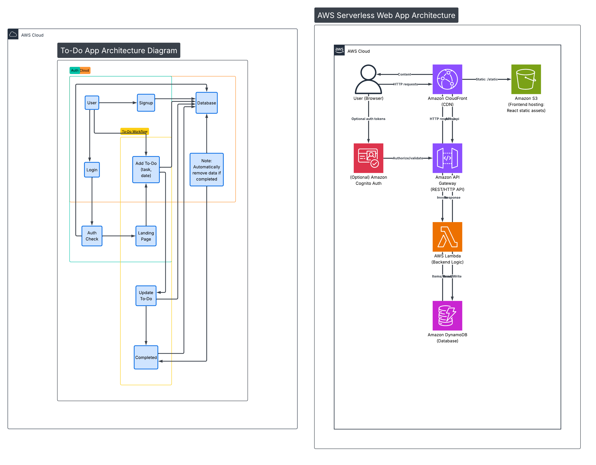

# 📌 To-Do Application – AWS Cloud Architecture

## 📖 Overview

This project is a cloud-based To-Do application built using serverless services on Amazon Web Services (AWS).

The application allows users to:

- Sign up
- Log in
- Add tasks
- Update tasks
- Mark tasks as completed
- Automatically remove completed tasks (optional feature)

The system is scalable, secure, and cost-efficient using AWS serverless architecture.

---

# 🏗 Architecture Overview

## 🔹 High-Level Flow

User → CloudFront → S3 → API Gateway → Lambda → DynamoDB

### Flow Explanation

1. User accesses the web application.
2. Frontend is served from Amazon S3.
3. CloudFront delivers content globally with HTTPS.
4. User authentication is handled by Amazon Cognito.
5. API requests go through Amazon API Gateway.
6. AWS Lambda handles business logic.
7. Data is stored in Amazon DynamoDB.

---

# 🧱 AWS Services Used

## 🌐 Frontend Layer

- **Amazon S3**
  - Hosts static frontend (React/Next.js build)
  - Provides scalable storage

- **Amazon CloudFront**
  - CDN for fast delivery
  - HTTPS enabled

---

## 🔐 Authentication Layer

- **Amazon Cognito**
  - User Signup
  - Login
  - JWT Token generation
  - Secure authentication

---

## ⚙ Backend & API Layer

- **Amazon API Gateway**
  - Creates REST API endpoints:
    - POST /tasks
    - GET /tasks
    - PUT /tasks/{id}
    - DELETE /tasks/{id}

- **AWS Lambda**
  - Add Task Function
  - Update Task Function
  - Complete Task Function
  - Get Tasks Function

---

## 🗄 Database Layer

- **Amazon DynamoDB**
  - NoSQL database
  - Fully managed
  - Auto-scaling

### Table Design

**Table Name:** Tasks

| Attribute | Type          | Description             |
| --------- | ------------- | ----------------------- |
| userId    | Partition Key | Unique User ID          |
| taskId    | Sort Key      | Unique Task ID          |
| title     | String        | Task title              |
| date      | String        | Due date                |
| status    | String        | pending / completed     |
| createdAt | String        | Task creation timestamp |

---

# 🔄 Task Workflow

## 1️⃣ Signup

- User registers via Cognito.

## 2️⃣ Login

- User logs in and receives JWT token.

## 3️⃣ Add Task

- Frontend sends POST request to API Gateway.
- Lambda validates user token.
- Task stored in DynamoDB.

## 4️⃣ Update Task

- PUT request updates task data.

## 5️⃣ Complete Task

- Status updated to "completed".
- Optional: Item automatically deleted using DynamoDB TTL.

---

# 🔐 Security

- IAM Roles control Lambda permissions.
- API Gateway validates Cognito JWT tokens.
- DynamoDB access restricted via IAM.
- HTTPS enforced using CloudFront.

---

# 📊 Monitoring & Logging

- Amazon CloudWatch logs:
  - API requests
  - Lambda executions
  - Errors and debugging information

---

# 🚀 Deployment Architecture

```
                CloudFront
                     │
                     ▼
                     S3
                     │
                     ▼
                API Gateway
                     │
                     ▼
                   Lambda
                     │
                     ▼
                 DynamoDB

Authentication → Cognito
Monitoring → CloudWatch
Security → IAM
```

---

# 💡 Benefits of This Architecture

- Fully Serverless
- Highly Scalable
- Low Cost (AWS Free Tier eligible)
- Secure Authentication
- Easy to Maintain

---

# 📌 Future Improvements

- Add CI/CD using AWS CodePipeline
- Add Custom Domain with AWS Certificate Manager
- Use Infrastructure as Code (Terraform / CloudFormation)
- Add Role-based Access Control
- Add Notifications using SNS

---

# 👨‍💻 Author

Your Name

---

# 📄 License

This project is licensed under the MIT License.
